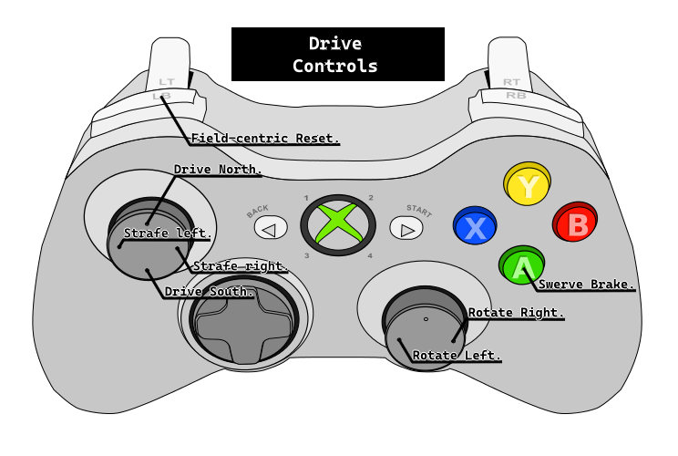
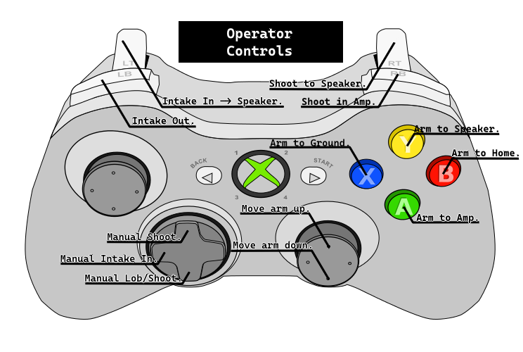

# Controller Bindings
The controllers we use are wired Xbox One controllers.\
One controller is for the Drivetrain and the other is for the Arm and it's functions.\
Remade for the new Swerve bot.
## Bindings
Drivetrain:
- Left Stick - Translate the robot.
  - X Axis - Strafe left or right.
  - Y Axis - Move the robot north or south.
- A - Swerve Brake.
- Left Bumper - Reset the field-centric heading.
<!-- end list -->
\
Arm:
 - Right Stick - Move the arm.
   - Y Axis - Move the arm up and down.
 - D-Pad - Manual controls.
   - Up - Manual shoot.
   - Left - Manual intake in.
   - Down - Manual lob/shoot at full power.
 - Right Trigger - Shoot to Speaker.
 - Left Trigger - Intake in, auto move to speaker.
 - Right Bumper - Shoot in Amp.
 - Left Bumper - Run intake out.
 - B - Move Arm to Home.
 - A - Move Arm to Amp.
 - Y - Move Arm to Speaker.
 - X - Move Arm to ground.
  <!-- end list -->
  
