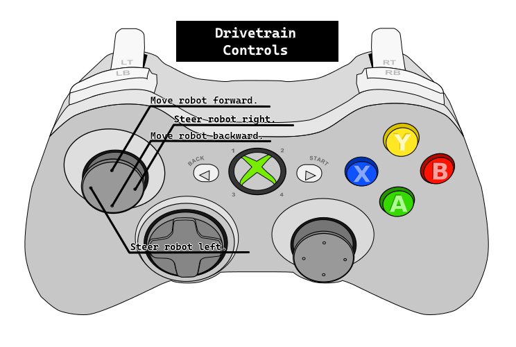
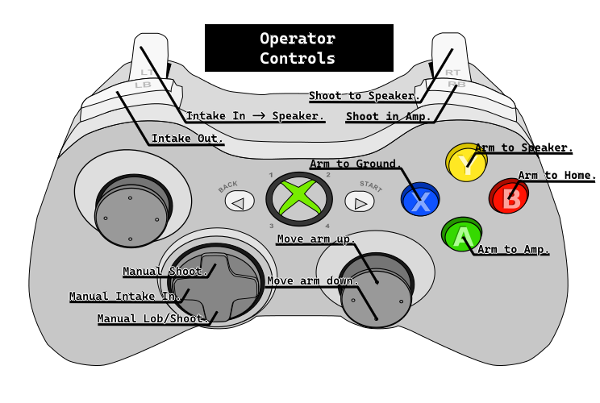

# Controller Bindings
The controllers we use are wired Xbox One controllers.\
One controller is for the Drivetrain and the other is for the Arm and it's functions.
## Bindings
Drivetrain:
- Left Stick - Driving.
  - X Axis - Steer the robot left or right.
  - Y Axis - Push the robot forward.
- A - Zero the drive encoders.
<!-- end list -->
\
Arm:
 - Right Stick - Move the arm.
   - Y Axis - Move the arm up and down via the Y Axis.
 - Right Trigger - Runs the shooter.
 - Left Trigger - Run intake in.
 - Left Bumper - Run intake out.
 - B - Run intake shoot command..
 - A - Zero the pivot point.
  <!-- end list -->
  
